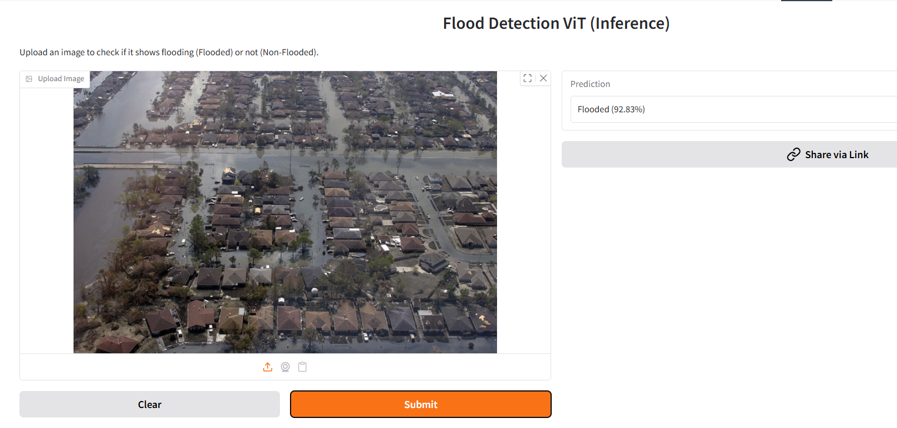

# 🌊 Flood Detection using Vision Transformers (ViT)

This project implements a robust computer vision pipeline to detect floods in images using a Fine-Tuned **Vision Transformer (ViT)**. It leverages **LoRA (Low-Rank Adaptation)** for parameter-efficient fine-tuning on proper binary classification.

You can try it on:  [flood-detection-vit-101](https://huggingface.co/spaces/arman1o1/flood-detection-vit-101)



## 🚀 Features

*   **State-of-the-Art Model**: Uses `google/vit-base-patch16-224-in21k` as the backbone.
*   **Efficient Training**: Implements **LoRA** (Low-Rank Adaptation) to fine-tune only ~0.6% of parameters.
*   **Auto Data Pipeline**: Automatically downloads the `louisiana-flood-2016` dataset from Kaggle via `kagglehub`.
*   **Interactive Inference**: Built-in **Gradio** interface for real-time testing.
*   **Deployment Ready**: Structure is compatible with Hugging Face Spaces.

## 🛠️ Installation

1.  **Clone the repository**:
    ```bash
    git clone https://github.com/arman1o1/flood-detection-ViT.git
    cd flood-detection-ViT
    ```

2.  **Install dependencies**:
    ```bash
    pip install -r requirements.txt
    ```

## ▶️ Usage

Run the main script:

```bash
python flood_detection_vit.py
```

**What happens next?**
1.  **Check**: The script looks for an existing trained model in `./flood_detection_vit_lora`.
2.  **Train (if needed)**: If no model is found, it:
    *   Downloads the dataset.
    *   Fine-tunes the ViT model for 3 epochs.
    *   Saves the adapters locally.
3.  **Deploy**: Launches a **Gradio** web interface (local/public link) where you can upload images to test the model.

## 📚 Technical Details

*   **Base Model**: Vision Transformer (ViT-Base)
*   **Optimization**: LoRA (Rank=16, Alpha=16, Target Modules=Query/Value)
*   **Frameworks**: PyTorch, Hugging Face Transformers, PEFT
*   **Dataset**: [Louisiana Flood 2016](https://www.kaggle.com/datasets/rahultp97/louisiana-flood-2016)

## 📜 License

MIT License
